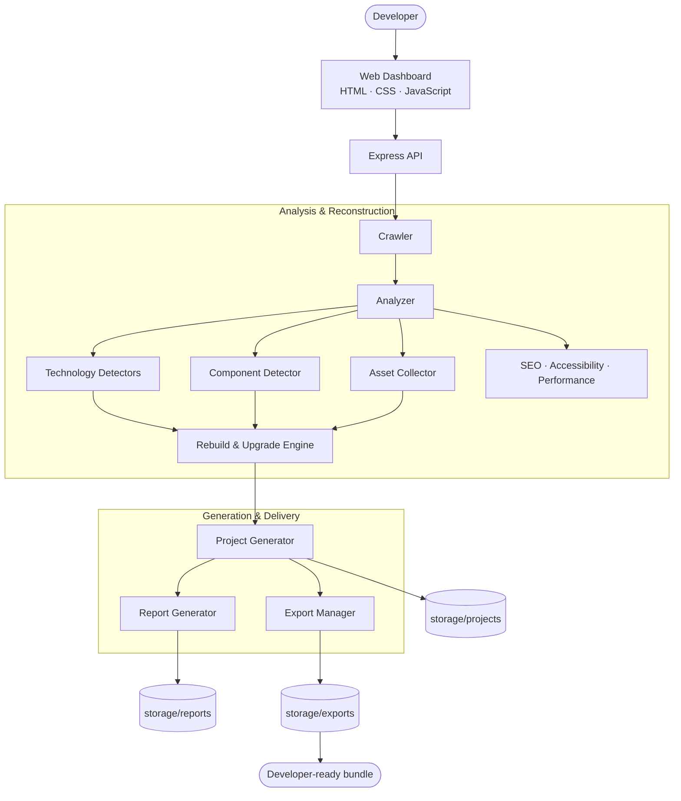
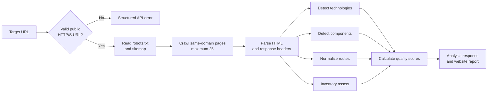
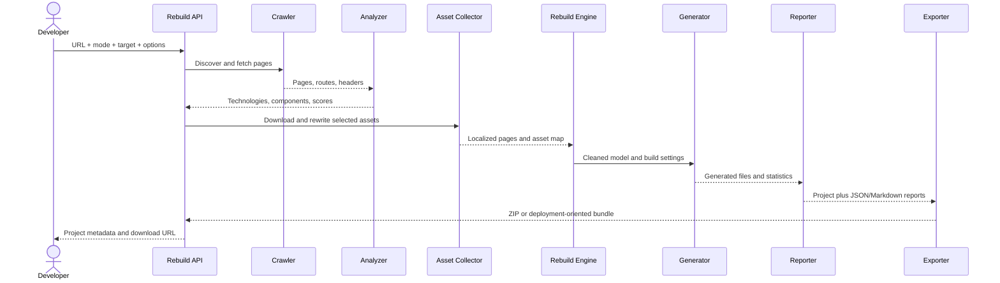

<div align="center">

# 🌐 Website Rebuilder AI

### Analyze. Reverse Engineer. Rebuild.

Website Rebuilder AI turns public websites into structured, developer-ready projects.
It crawls pages, identifies technologies and components, audits quality, rebuilds the
site in your chosen stack, and packages the result for continued development.

[](https://nodejs.org/)
[](https://expressjs.com/)
[](https://developer.mozilla.org/docs/Web/JavaScript)
[](#license)

[](https://github.com/one1of1one/website-rebuilder-ai/actions/workflows/ci.yml)
[](https://github.com/one1of1one/website-rebuilder-ai/actions/workflows/codeql.yml)
[](https://github.com/one1of1one/website-rebuilder-ai/stargazers)
[](https://github.com/one1of1one/website-rebuilder-ai/forks)
[](https://github.com/one1of1one/website-rebuilder-ai/issues)
[](https://github.com/one1of1one/website-rebuilder-ai/commits/main)

[Quick Start](#-installation) ·
[Features](#-key-features) ·
[Architecture](#-architecture) ·
[API](#-api-reference) ·
[Documentation](#-documentation) ·
[Contributing](CONTRIBUTING.md)

</div>
---

## ✨ Introduction

Website Rebuilder AI is **not a simple website downloader**. A downloader copies
the response it receives; Website Rebuilder AI examines how a site is assembled,
models its routes and reusable regions, and creates an editable project around the
result.

The engine can:

- 🔎 Analyze public HTTP and HTTPS websites across multiple same-domain pages.
- 🧬 Detect frameworks, libraries, CMS products, analytics tools, and delivery services.
- 🧩 Identify semantic components such as navigation, heroes, cards, forms, and footers.
- 🏗️ Rebuild analyzed content into clean, target-specific project structures.
- 🪄 Upgrade markup, responsive foundations, SEO metadata, and accessibility attributes.
- 📦 Export persistent, developer-ready projects with source files, reports, and assets.

> [!IMPORTANT]
> Website Rebuilder AI reconstructs what a browser can access. It does not recover
> private source code, databases, server configuration, or original backend logic.

> [!NOTE]
> The current AI rebuild and chat paths are deterministic and rule-based. Provider
> abstractions for OpenAI, Claude, Gemini, Ollama, and OpenRouter are integration
> points; no external AI service is required to run the project.

---

## 🚀 Key Features

| Capability | What it delivers |
| :--- | :--- |
| ✅ **Website Analysis** | Crawls up to 25 same-domain pages and inventories content, routes, headers, and assets. |
| ✅ **Technology Detection** | Recognizes frontend stacks, CMS platforms, libraries, analytics, CDNs, and service integrations. |
| ✅ **Component Detection** | Finds headers, navigation, heroes, sliders, cards, galleries, forms, FAQs, pricing, tabs, and more. |
| ✅ **SEO Analysis** | Scores titles, metadata, canonical URLs, semantic structure, and other discoverability signals. |
| ✅ **Accessibility Analysis** | Surfaces common accessibility gaps and can improve selected markup attributes. |
| ✅ **Performance Analysis** | Reports asset and document signals that influence page weight and delivery quality. |
| ✅ **AI Rebuild Mode** | Applies rule-based cleanup, semantic section extraction, component splitting, and code generation. |
| ✅ **AI Upgrade Mode** | Modernizes markup, responsive layout foundations, metadata, accessibility, CSS, and JavaScript. |
| ✅ **Framework Migration** | Reconstructs analyzed pages inside a selected target framework scaffold. |
| ✅ **Project Export** | Creates ZIP, Git-oriented, Docker, Plesk, cPanel, or FTP-ready bundles. |
| ✅ **Reports** | Persists JSON and Markdown reports with scores, routes, assets, technologies, and project statistics. |
| ✅ **AI Chat** | Provides project-aware, rule-based change suggestions through a stable provider-ready API. |
| ✅ **Project History** | Stores generated project metadata, editable files, reports, and reusable download links. |

### Rebuild modes

| Mode | Best for | Behavior |
| :--- | :--- | :--- |
| 🪞 **Mirror Website** | High-fidelity local reconstruction | Downloads reachable content and assets, rewrites paths, and wraps the result in the selected output. |
| 🧠 **AI Rebuild Project** | Cleaner developer handoff | Detects sections, normalizes classes, deduplicates CSS, and creates reusable components. |
| ⬆️ **AI Upgrade** | Modernizing an older frontend | Adds semantic HTML, responsive foundations, extracted styles/scripts, SEO, and accessibility improvements. |
| 🔁 **Framework Migration** | Moving to a new stack | Uses the analysis model to generate a scaffold-first project for the chosen target. |

---

## 📦 Supported Outputs

Generation targets and delivery formats are deliberately separated: a target controls
the generated source structure, while an export format controls how that project is
packaged.

| Output | Type | Generated result |
| :--- | :---: | :--- |
| **Static HTML** | Project | Multi-page HTML, CSS, JavaScript, localized assets, and component annotations. |
| **PHP** | Project | PHP pages and reusable includes/components. |
| **Laravel** | Project | Laravel-oriented scaffold with Blade-ready structure and migration notes. |
| **React** | Project | Component-oriented React scaffold for continued application development. |
| **Next.js** | Project | Next.js project scaffold with page and component boundaries. |
| **Vue** | Project | Vue scaffold with generated component structure. |
| **WordPress Theme** | Project | Theme-oriented PHP structure ready for WordPress development. |
| **Express** | Project | Node.js and Express scaffold serving the reconstructed frontend. |
| **ASP.NET** | Project | ASP.NET-oriented scaffold and generated web assets. |
| **Docker** | Export | Container files added to a generated project bundle. |
| **ZIP** | Export | Portable archive containing source, assets, and reports. |

Additional implemented targets include **Nuxt** and **Node**. Additional export
presets include **Git Repository**, **Plesk**, **cPanel**, and **FTP Package**.

---

## 🏛️ Architecture

The application uses a plain HTML, CSS, and JavaScript frontend with a Node.js and
Express backend. The backend composes focused crawler, analysis, reconstruction,
generation, reporting, storage, and export modules.

### System architecture



### Analysis pipeline



### Rebuild pipeline



For the extended diagrams, including storage, exports, API flows, and the provider
abstraction, see [Architecture Diagrams](docs/14-architecture-diagrams.md).

---

## 🖼️ Screenshots

### Dashboard


### Analysis


### Inspector


### Reports


### Export


---

## 🛠️ Installation

### Prerequisites

- [Node.js](https://nodejs.org/) 18 or newer
- npm
- Git
- Network access to the public sites you are authorized to analyze

### 1. Clone the repository

```bash
git clone https://github.com/one1of1one/website-rebuilder-ai.git
cd website-rebuilder-ai
```

### 2. Install dependencies

```bash
npm install
```

### 3. Start the application

```bash
npm start
```

Open [http://localhost:3000](http://localhost:3000). Set `PORT` to run the server
on a different port.

### 4. Run the test suite

```bash
npm test
```

For file-watching development or API verification:

```bash
npm run dev
npm run verify:endpoints
```

> [!TIP]
> Start the server before running `npm run verify:endpoints`. The verification
> script accepts `BASE_URL` or `PORT` when the server is not using its default.

---

## 🎛️ Usage

1. Enter a public website URL and a project name.
2. Run **Analyze URL** to inspect the site before generation.
3. Choose a project output, rebuild mode, export preset, and asset options.
4. Start the rebuild and allow the bounded crawler to inspect same-domain pages.
5. Review the report, component map, routes, assets, and generated file tree.
6. Edit stored project files or request project-aware suggestions through AI Chat.
7. Download the generated archive or create another export from project history.

> [!WARNING]
> Only analyze or rebuild websites you own or have explicit permission to copy.
> You are responsible for copyright, trademark, privacy, and terms-of-service compliance.

---

## 🔌 API Reference

All endpoints are served from the same Express application. JSON request bodies are
limited to 32 KB, and API failures return structured HTTP errors.

| Method | Endpoint | Purpose |
| :---: | :--- | :--- |
| `POST` | `/api/analyze` | Analyze a URL without generating a project. |
| `POST` | `/api/rebuild` | Analyze, rebuild, report, persist, and package a project. |
| `POST` | `/api/migrate` | Run a rebuild with framework migration mode enabled. |
| `GET` | `/api/projects` | List up to 100 stored projects, newest first. |
| `GET` | `/api/project/:projectId` | Return project metadata, report, and current file list. |
| `GET` | `/api/project/:projectId/files` | List the editable files in a stored project. |
| `GET` | `/api/project/:projectId/file?path=...` | Read one UTF-8 project file. |
| `POST` | `/api/project/:projectId/file` | Save one UTF-8 project file. |
| `GET` | `/api/project/:projectId/inspector` | Return project, component, asset, and ZIP statistics. |
| `GET` | `/api/report/:projectId` | Return a persisted website report. |
| `POST` | `/api/export` | Package a stored project with a selected export preset. |
| `POST` | `/api/chat` | Return a project-aware rule-based change suggestion. |
| `GET` | `/api/download/:zipName` | Download a generated project archive. |

Accepted rebuild modes are `mirror`, `ai-rebuild`, `ai-upgrade`, and
`framework-migration`. Accepted project targets are `static-html`, `php`,
`laravel`, `wordpress`, `nextjs`, `nuxt`, `react`, `vue`, `aspnet`, `express`,
and `node`.

Accepted export formats are `zip`, `git`, `docker`, `plesk`, `cpanel`, and `ftp`.
See [API Design](docs/04-api-design.md) for the compatibility principles behind
the route contracts.

---

## 📚 Documentation

| # | Guide | Focus |
| :---: | :--- | :--- |
| 00 | [Product Vision](docs/00-product-vision.md) | Product problem, audience, value, scope, and guiding principles. |
| 01 | [Roadmap](docs/01-roadmap.md) | Long-range engine, AI, migration, and SaaS direction. |
| 02 | [System Architecture](docs/02-system-architecture.md) | Main subsystems, runtime split, data flow, and design rules. |
| 03 | [Folder Structure](docs/03-folder-structure.md) | Target repository layout and module responsibilities. |
| 04 | [API Design](docs/04-api-design.md) | Endpoint contracts, payload concepts, and compatibility rules. |
| 05 | [Database Design](docs/05-database-design.md) | Logical entities, storage strategy, and recommended schema. |
| 06 | [Engine Design](docs/06-engine-design.md) | Engine stages, module boundaries, and extension principles. |
| 07 | [AI Engine](docs/07-ai-engine.md) | Provider abstraction, current mode, and integration responsibilities. |
| 08 | [Plugin System](docs/08-plugin-system.md) | Plugin contracts, hooks, goals, types, and governance. |
| 09 | [Deployment Strategy](docs/09-deployment-strategy.md) | Local and production deployment direction. |
| 10 | [Security](docs/10-security.md) | Threat model, defensive rules, and data-handling expectations. |
| 11 | [Testing Strategy](docs/11-testing-strategy.md) | Test layers, regression targets, and automation guidance. |
| 12 | [Coding Standards](docs/12-coding-standards.md) | JavaScript, product, and documentation conventions. |
| 13 | [Sprint Plan](docs/13-sprint-plan.md) | Sprint sequencing, deliverables, and execution rules. |
| 14 | [Architecture Diagrams](docs/14-architecture-diagrams.md) | Mermaid views of system, API, storage, AI, and export flows. |
| 15 | [Decision Log](docs/15-decision-log.md) | Architecture decision records and their consequences. |

Project-level context is also available in the [Changelog](CHANGELOG.md) and
[engineering task list](TODO.md).

---

## 🗂️ Project Structure

```text
website-rebuilder-ai/
├── backend/
│   ├── ai/                    # Provider registry and project-aware chat
│   ├── api/                   # Express route registration
│   ├── engine/                # Unified backend engine
│   ├── generators/            # Static, PHP, Next.js, and scaffold generators
│   ├── reports/               # Report generation entrypoints
│   ├── storage/               # Persistent storage interface
│   ├── analyzer.js            # DOM, technology, and quality analysis
│   ├── asset-collector.js     # Downloading and path rewriting
│   ├── cleaner.js             # HTML, CSS, and JavaScript cleanup
│   ├── component-detector.js  # Semantic section recognition
│   ├── crawler.js             # Bounded same-domain crawler
│   ├── export-manager.js      # Deployment/export preset files
│   ├── project-generator.js   # Multi-target project generation
│   ├── rebuilder.js           # Rebuild and upgrade transformations
│   ├── reporter.js            # Scores, reports, and project statistics
│   └── server.js              # Application entrypoint
├── docs/                      # Product and engineering documentation
├── engine/
│   ├── accessibility/         # Accessibility engine
│   ├── component-extractor/   # Component extraction engine
│   └── seo/                   # SEO engine
├── frontend/
│   ├── app.js                 # Dashboard behavior
│   ├── index.html             # Application shell
│   └── style.css              # Dashboard design system
├── scripts/
│   └── verify-endpoints.js    # Running-server API verification
├── storage/
│   ├── cache/                 # Temporary rebuild/export workspaces
│   ├── exports/               # Persisted export mirrors
│   ├── projects/              # Editable generated projects
│   └── reports/               # Persisted analysis reports
├── tests/
│   ├── fixtures/              # Representative HTML test inputs
│   ├── analyzer.test.js       # Analyzer assertions
│   ├── generator.test.js      # Generator assertions
│   └── run-tests.js           # Test suite entrypoint
├── output/                    # Downloadable ZIP archives
├── CHANGELOG.md
├── package.json
└── README.md
```

---

## 🗺️ Roadmap

The milestones below describe the path to a stable public `v1.0`. Scope may move
between milestones as reliability data and contributor feedback improve.

### v0.5 — Analysis Foundation

- [ ] Expand technology signatures and confidence scoring.
- [ ] Add richer route, asset, and component relationship views.
- [ ] Strengthen analyzer fixtures and regression coverage.

### v0.6 — Reconstruction Quality

- [ ] Improve component boundary detection and naming.
- [ ] Increase visual fidelity across multi-page static and PHP builds.
- [ ] Add deterministic rebuild snapshots for quality comparison.

### v0.7 — Framework Depth

- [ ] Deepen React, Next.js, Vue, Laravel, and WordPress generation.
- [ ] Add target-specific linting and build validation.
- [ ] Produce clearer migration notes for unsupported behavior.

### v0.8 — AI Provider Runtime

- [ ] Connect the provider abstraction to opt-in refactoring workflows.
- [ ] Add provider configuration, timeouts, budgets, and safe fallbacks.
- [ ] Preserve deterministic local mode for offline operation.

### v0.9 — Production Hardening

- [ ] Add queued jobs, cancellation, progress events, and recovery.
- [ ] Harden URL fetching, storage boundaries, and archive validation.
- [ ] Add CI matrices, end-to-end tests, and deployment recipes.

### v1.0 — Stable Rebuilder Platform

- [ ] Publish stable API and project-format contracts.
- [ ] Deliver validated generation paths and reproducible exports.
- [ ] Complete security review, migration guide, and release documentation.

Track active implementation work in [TODO.md](TODO.md) and release history in
[CHANGELOG.md](CHANGELOG.md).

---

## ❓ FAQ

<details>
<summary><strong>1. Can it recover server-side PHP or other backend source?</strong></summary>

No. Public web responses contain rendered HTML and assets, not private PHP,
controllers, database queries, credentials, or server configuration. The PHP output
is a new reconstruction based on observable behavior and structure.
</details>

<details>
<summary><strong>2. Can it rebuild a React or Next.js website?</strong></summary>

It can analyze the HTML returned by a public React or Next.js site and generate a new
React or Next.js-oriented scaffold. It does not recover the site's original source
components, state model, build configuration, or private APIs.
</details>

<details>
<summary><strong>3. Can it clone private or authenticated websites?</strong></summary>

No authenticated browser session or login automation is implemented. Analyze only
publicly reachable pages that you are authorized to reproduce.
</details>

<details>
<summary><strong>4. Does it support WordPress?</strong></summary>

Yes. The detector recognizes common WordPress signals, and `wordpress` is an
implemented generation target. The result is a reconstructed theme structure, not a
copy of the source site's database, plugins, admin settings, or proprietary theme.
</details>

<details>
<summary><strong>5. Does AI Rebuild Mode require an API key?</strong></summary>

No. Current rebuild and chat behavior is deterministic and rule-based. Provider
adapters are architectural extension points and are not required for local use.
</details>

<details>
<summary><strong>6. Will JavaScript-rendered content be captured?</strong></summary>

Not always. The crawler processes returned HTTP HTML and does not currently execute a
full browser runtime. Content inserted only after client-side execution may be absent.
</details>

<details>
<summary><strong>7. How many pages can one analysis crawl?</strong></summary>

The crawler is intentionally bounded to 25 same-domain pages. It checks robots and
sitemap hints, normalizes internal links, and records failed pages.
</details>

<details>
<summary><strong>8. Are images, fonts, videos, and styles downloaded?</strong></summary>

They can be, according to the selected asset options. Reachable assets are organized
locally and paths are rewritten; blocked or unavailable assets retain their remote URL.
</details>

<details>
<summary><strong>9. Is the generated project production-ready?</strong></summary>

It is developer-ready: structured, editable, report-backed, and suitable as a strong
starting point. You should still review security, licensing, functionality,
accessibility, performance, forms, APIs, and deployment settings before production.
</details>

<details>
<summary><strong>10. Can it reproduce forms, payments, or databases?</strong></summary>

It can detect and reconstruct visible form markup, but it cannot infer private
handlers, payment secrets, data models, or database behavior. Those integrations must
be implemented and tested separately.
</details>

<details>
<summary><strong>11. What is the difference between a target and an export?</strong></summary>

A target such as Next.js or Laravel determines the generated project structure. An
export such as ZIP or Docker determines how the stored project is packaged and
delivered.
</details>

<details>
<summary><strong>12. Where are projects and reports stored?</strong></summary>

Editable projects live in `storage/projects`, report mirrors in `storage/reports`,
export mirrors in `storage/exports`, temporary workspaces in `storage/cache`, and
downloadable archives in `output`.
</details>

---

## 🤝 Contributing

Contributions should improve reconstruction accuracy without overstating what can be
recovered from a public website.

Before participating, read the [contribution guide](CONTRIBUTING.md),
[security policy](SECURITY.md), and [Code of Conduct](CODE_OF_CONDUCT.md). Use the
[GitHub issue templates](https://github.com/one1of1one/website-rebuilder-ai/issues/new/choose)
for reproducible bug reports, focused feature proposals, and project questions.

1. Search [existing issues](https://github.com/one1of1one/website-rebuilder-ai/issues)
   before proposing overlapping work.
2. Open an issue for substantial behavior or architecture changes.
3. Fork the repository and create a focused branch from the current default branch.
4. Follow the [coding standards](docs/12-coding-standards.md) and preserve public API
   compatibility.
5. Add or update fixtures and tests for analyzer or generator behavior.
6. Run the relevant checks:

   ```bash
   npm test
   npm run verify:endpoints
   ```

7. Update documentation when behavior, contracts, outputs, or limitations change.
8. Submit a pull request explaining the problem, approach, validation, and tradeoffs.

Keep pull requests narrow, avoid unrelated formatting churn, and never commit generated
projects, credentials, private website content, or copyrighted assets without permission.

For security-sensitive findings, avoid publishing exploit details until maintainers have
had a reasonable opportunity to assess and address the report.

---

## ⚖️ License

Website Rebuilder AI is distributed under the **MIT License**.

The license covers this project's source code, not third-party websites or assets
processed with it. You must have the legal right to analyze, copy, modify, and distribute
any external content included in a generated project.

---

<div align="center">

**Website Rebuilder AI**

Analyze. Reverse Engineer. Rebuild.

[Report a Bug](https://github.com/one1of1one/website-rebuilder-ai/issues/new?template=bug_report.md) ·
[Request a Feature](https://github.com/one1of1one/website-rebuilder-ai/issues/new?template=feature_request.md) ·
[Read the Docs](docs/00-product-vision.md)

</div>
