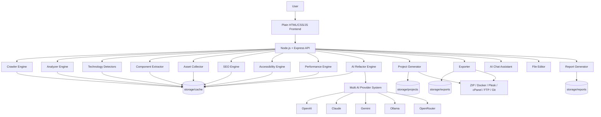
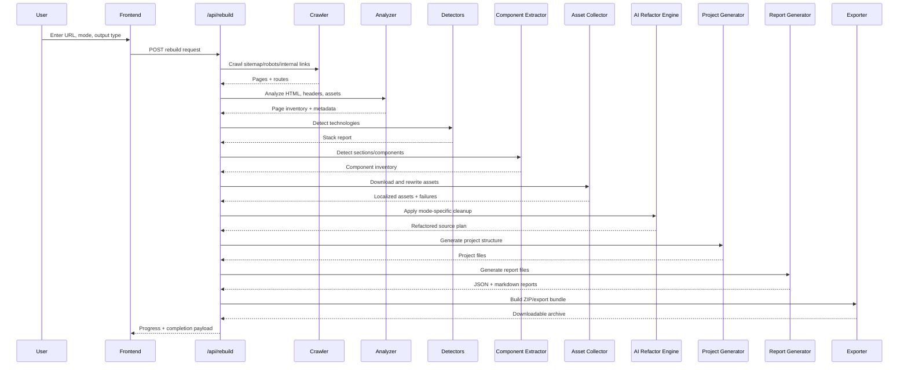
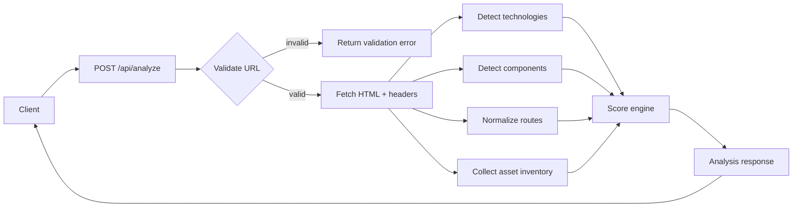
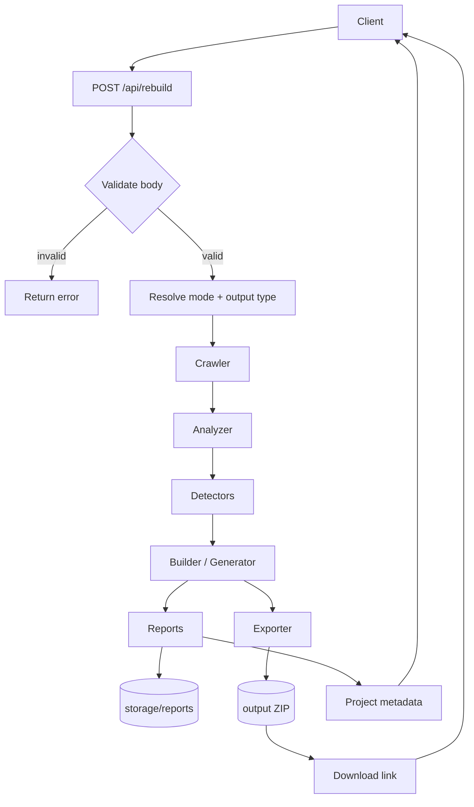
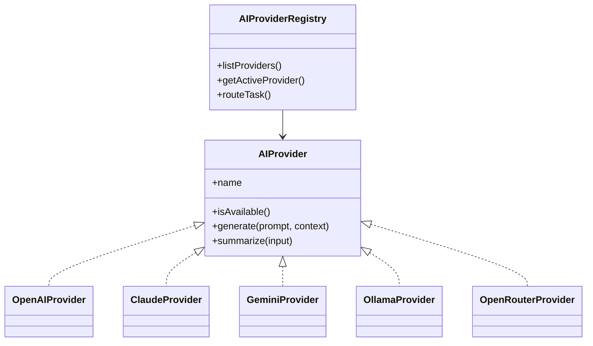
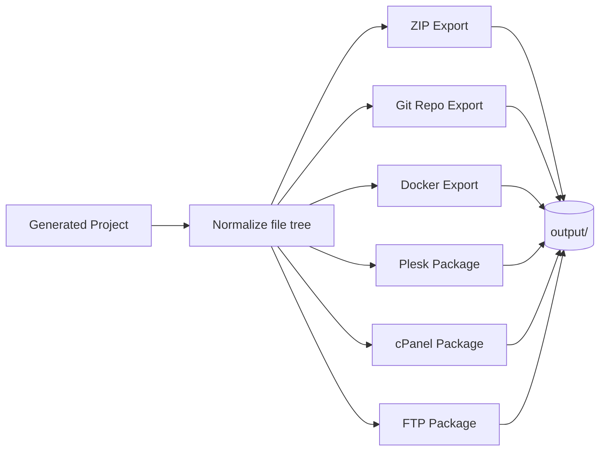
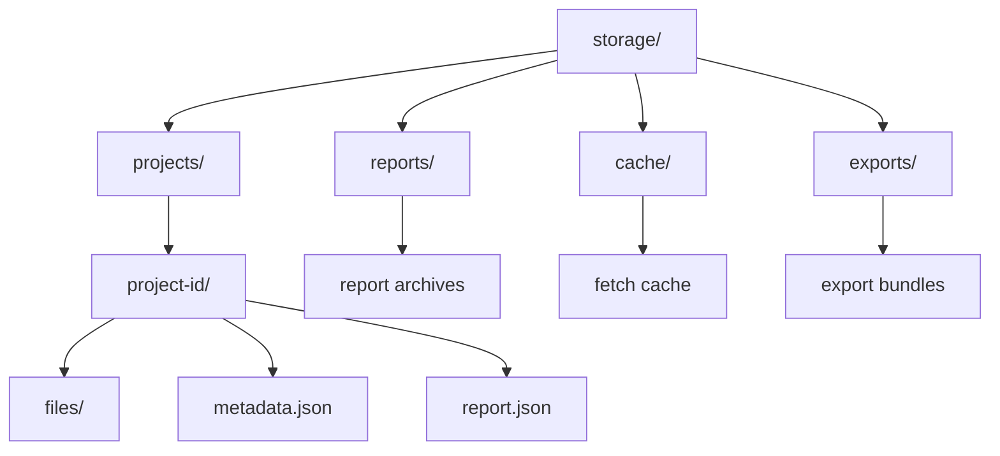
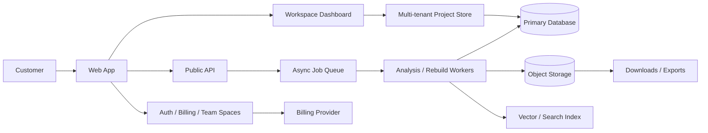

# 14. Architecture Diagrams

This document provides the canonical architecture visuals for Reforge AI. The
diagrams are Mermaid-based so they can be rendered in GitHub, most markdown
viewers, and internal documentation tools.

## Full system architecture

## Rebuild pipeline

## Analyze API flow

## Rebuild API flow

## AI provider abstraction

## Export pipeline

## Storage layout

## Future SaaS architecture

